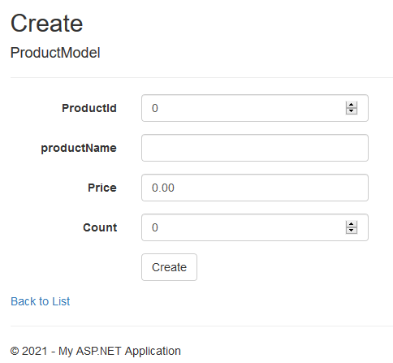

<p align="center"></p>>

<h1 align="center">
    <strong>PRODUCTS</strong>
</h1>
<h3 align="center">
    <p>Producst CRUD Web App with ASP.NET</p>
</h3>

## Contents
- [Tools needed](#tools-needed)
- [Database](#database)
- [Creating project](#creating-project)
- [CRUD Read](#crud-read)
- [CRUD Create](#crud-create)
- [CRUD Update](#crud-update)
- [CRUD Delete](#crud-delete)

## Tools needed
* Visual Studio           - https://visualstudio.microsoft.com/
* Microsoft SQL Server    - https://www.microsoft.com/en-us/sql-server/sql-server-downloads

## Database
On Microsoft SQL Server Management Studio create new database\
Databbase Name: **MvcCrudDB**\
Table Name: **Products**\

Columns:
* ProductID - int
* ProducName - varchar(50)
* Price - decimal(18,2)
* Count - int

Set 'ProductID' as Primary Key and on Column Properties 'Identity Specification -> Yes' for auto fill.

## Creating project
1. On Visual Studio create new 'ASP.NET Web Application' project with 'MVC'
2. Add controller 'MVC 5 Controller with read/write actions' to 'Controllers' and name it 'ProductController'
3. On 'Products/App_Starti/RouteConfig.cs' change default route to
```
defaults: new { controller = "Product", action = "Index", id = UrlParameter.Optional }
```

## CRUD Read
On 'ProductsController' we will display products in our database.\
We will add
```
using System.Data.SqlClient;
using Products.Models;
```

To get Database Connectionstring in Microsoft SQL Server Management Studio start server.\
In Visual Studio 'Server Explorer' Connect to Database. Select DB server and connect.\
Connection string will be displayed.

And create method with 'HttpGet' type
```
string connectionString = @".................";
// GET: Product
[HttpGet]
public ActionResult Index()
{
    DataTable dtblProduct = new DataTable();
    using(SqlConnection sqlCon = new SqlConnection(connectionString))
    {
        sqlCon.Open();
        SqlDataAdapter sqlDa = new SqlDataAdapter("SELECT * FROM Product", sqlCon);
        sqlDa.Fill(dtblProduct);
    }
    return View(dtblProduct);
}
```

On right-click in method and select 'Add View' and click 'Add'\
This will create 'index.cshtml' in our 'Product' folder where we write our main page
```
@model System.Data.DataTable
@{
    ViewBag.Title = "Index";
}

<table class="table table-bordered table-striped">
    <tr>
        <th>Product Name</th>
        <th>Product Price</th>
        <th>Count</th>
        <th></th>
    </tr>
    @for(int i = 0; i < Model.Rows.Count; i++)
            {
                <tr>
                    <td>@Model.Rows[i][1]</td>
                    <td>@Model.Rows[i][2]</td>
                    <td>@Model.Rows[i][3]</td>
                </tr>
            }
</table>
```

## CRUD Create
In 'Models' folder we will add 'ProductModel.cs' class
```
using System;
using System.Collections.Generic;
using System.ComponentModel;
using System.Linq;
using System.Web;

namespace Products.Models
{
    public class ProductModel
    {
        public int ProductId { get; set; }
        [DisplayName("Product Name")]
        public string productName { get; set; }
        public decimal Price { get; set; }
        public int Count { get; set; }
    }
}
```

Now we can view our 'Create' page on our browswr localhost server ./Product/Create
<p align="center"><p>
    
We'll add option to add new product in our 'index.cshtml'
```
<a href="@Url.Action("Create","Product")">Add Product</a>
```
Clicking on that will open create view 'Create.cshtml'

We'll add create method with 'HttpPost' type
```
// POST: Product/Create
[HttpPost]
public ActionResult Create(ProductModel productModel)
{
    using (SqlConnection sqlCon = new SqlConnection(connectionString))
    {
        sqlCon.Open();
        string query = "INSERT INTO Product VALUES(@ProductName,@Price,@Count)";
        SqlCommand sqlCmd = new SqlCommand(query, sqlCon);
        sqlCmd.Parameters.AddWithValue("@ProductName",productModel.productName);
        sqlCmd.Parameters.AddWithValue("@Price",productModel.Price);
        sqlCmd.Parameters.AddWithValue("@Count",productModel.Count);
        sqlCmd.ExecuteNonQuery();
    }
    return RedirectToAction("Index");
}
```

## CRUD Update
We'll create edit method on 'ProductsController.cs'
```
// GET: Product/Edit/5
public ActionResult Edit(int id)
{
    ProductModel productModel = new ProductModel();
    DataTable dtblProduct = new DataTable();
    using(SqlConnection sqlCon = new SqlConnection(connectionString))
    {
        sqlCon.Open();
        string query = "SELECT * FROM Product Where ProductID = @ProductID";
        SqlDataAdapter sqlDa = new SqlDataAdapter(query, sqlCon);
        sqlDa.SelectCommand.Parameters.AddWithValue("@ProductID", id);
        sqlDa.Fill(dtblProduct);
    }
    if(dtblProduct.Rows.Count == 1)
    {
        productModel.ProductId = Convert.ToInt32(dtblProduct.Rows[0][0].ToString());
        productModel.productName = dtblProduct.Rows[0][1].ToString();
        productModel.Price = Convert.ToDecimal(dtblProduct.Rows[0][2].ToString());
        productModel.Count = Convert.ToInt32(dtblProduct.Rows[0][3].ToString());
        return View(productModel);
    }
    return View();
}
```

Right click inside method and Add View with 'Edit' and with 'ProductModel(Products.Models)' class.\
This will add edit view 'edit.cshtml'

On 'index.cshtml' we will add 'Edit' hyperlink
```
<a href="@Url.Action("Edit", "Product", new { @id=Model.Rows[i][0]})">Edit</a>
```

In 'ProductController.cs' we'll use Edit HTTPPost method to save changes in db
```
// POST: Product/Edit/5
[HttpPost]
public ActionResult Edit(ProductModel productModel)
{
    using (SqlConnection sqlCon = new SqlConnection(connectionString))
    {
        sqlCon.Open();
        string query = "UPDATE Product SET ProductName = @ProductName , Price = @price, Count = @Count WHERE ProductID = @ProductID";
        SqlCommand sqlCmd = new SqlCommand(query, sqlCon);
        sqlCmd.Parameters.AddWithValue("@ProductID", productModel.ProductId);
        sqlCmd.Parameters.AddWithValue("@ProductName", productModel.productName);
        sqlCmd.Parameters.AddWithValue("@Price", productModel.Price);
        sqlCmd.Parameters.AddWithValue("@Count", productModel.Count);
        sqlCmd.ExecuteNonQuery();
    }
    return RedirectToAction("Index");
}
```

## CRUD Delete
For delete operation we use Delete GET mehtod in 'ProductController.cs'
```
// GET: Product/Delete/5
public ActionResult Delete(int id)
{
    using(SqlConnection sqlCon = new SqlConnection(connectionString))
    {
        sqlCon.Open();
        string query = "DELETE FROM Product WHERE ProductID = @ProductID";
        SqlCommand sqlCmd = new SqlCommand(query, sqlCon);
        sqlCmd.Parameters.AddWithValue("@ProductID", id);
        sqlCmd.ExecuteNonQuery();
    }

    return RedirectToAction("Index");
}
```
